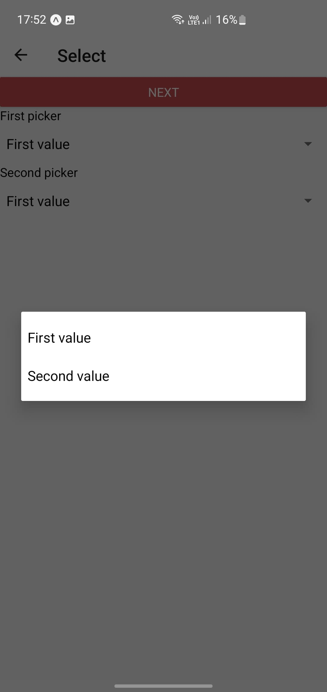

# Aplikacje Mobilne Lab 4 - Dominik Makuch 22662

Wykorzystanie komponentów:

 TextInput, DateTimePicker, Picker, Switch, Modal, Alert, ToastAndroid.

## TextInput
Różne zastosowania textInput

Przykład działania:

Klawiatura numeryczna: 

## Select
Komponent picker:

## Switch & Modal
Wywołanie i chowanie modala z wykorzystaniem switch:

## Wybór daty i czasu
Date i time pickery prezentujące wybraną datę i czas za pomocą modala:

## Toast

Wykorzystanie modala i komponentu toast.

## DateTimeSelect.js:

## Select.js:
