### Laboratorium 5 - Dominik Makuch 22662
Obsługa gestów uzytkownika

### Opisanie kodu
#### App.js

- Strona główna

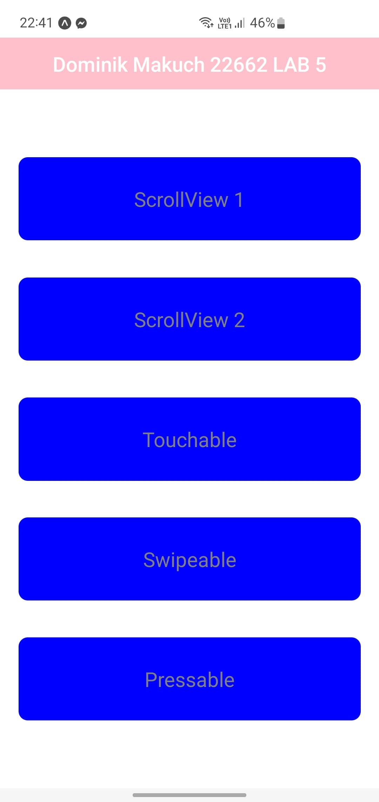

- ScrollView 1

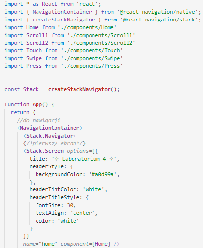

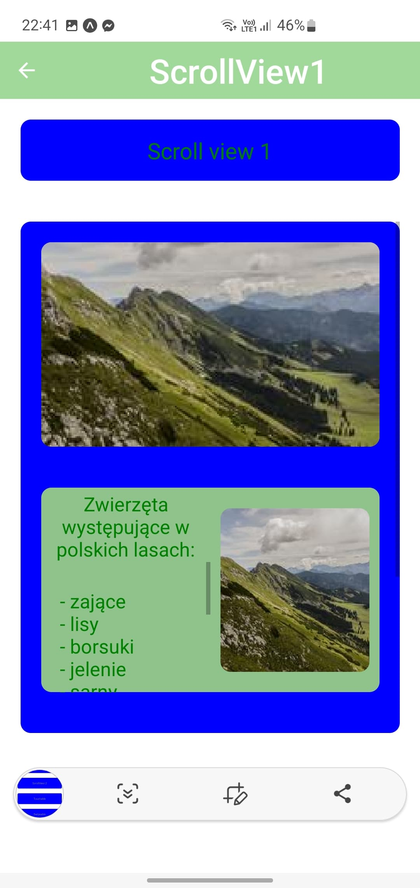

- ScrollView 2

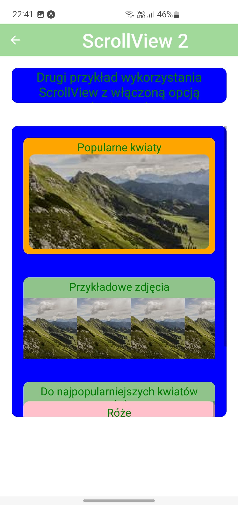
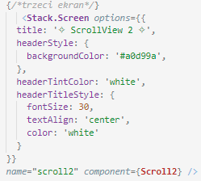

- Touchable

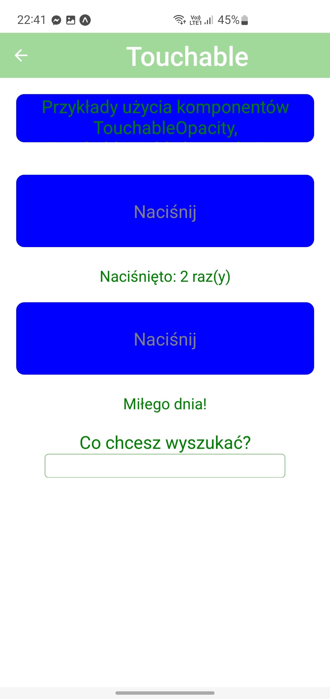
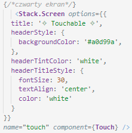

- Swipable

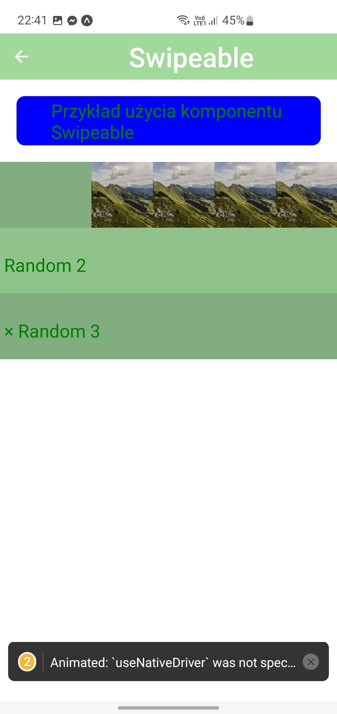
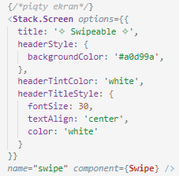

- Pressable

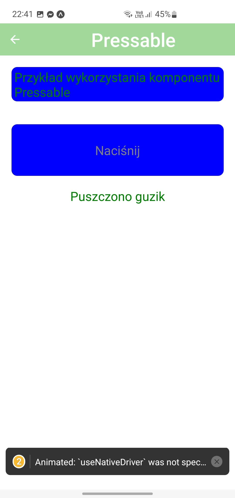
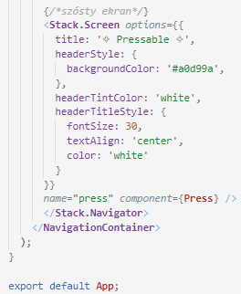
