# LAB6 - obsługa obrazów - tryb offline

# Dominik Makuch 22662


## Home

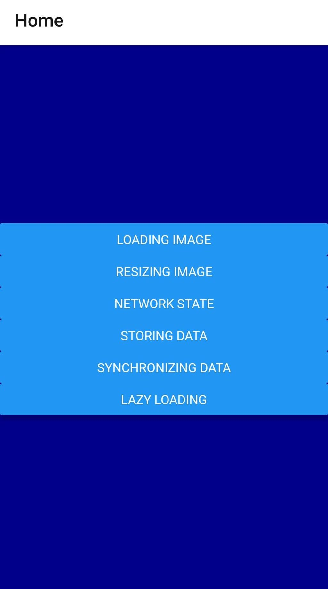

## Loading image
Pierwszy obrazek ładowany jest za pomocą `uri`, drugi za pomocą `require()`

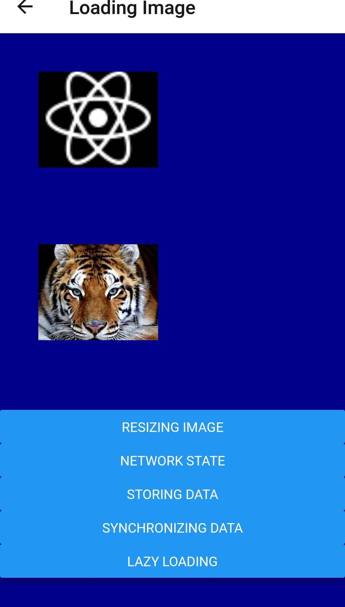

## Resizing image

Komponent `Slider` umożliwia zmianę rozmiaru obrazka

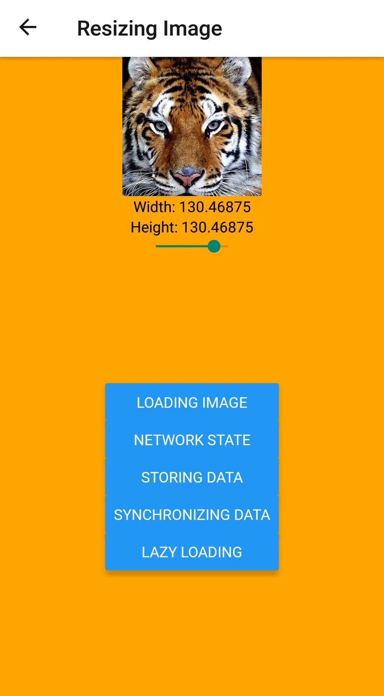

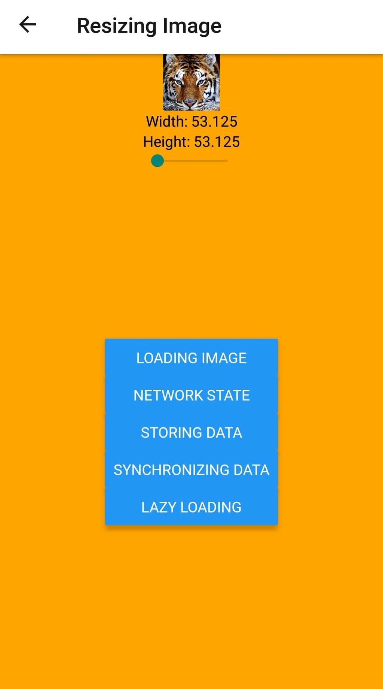

## Lazy loading

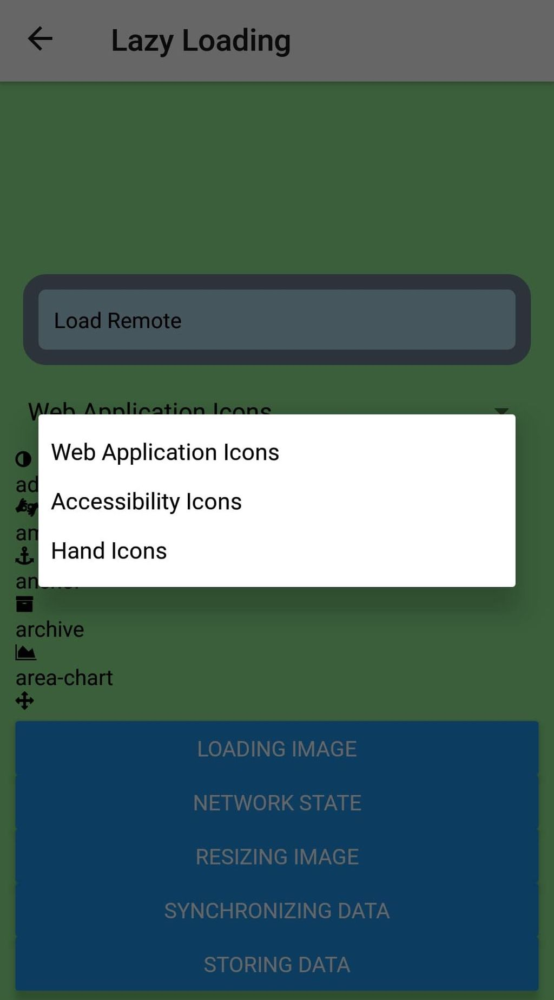

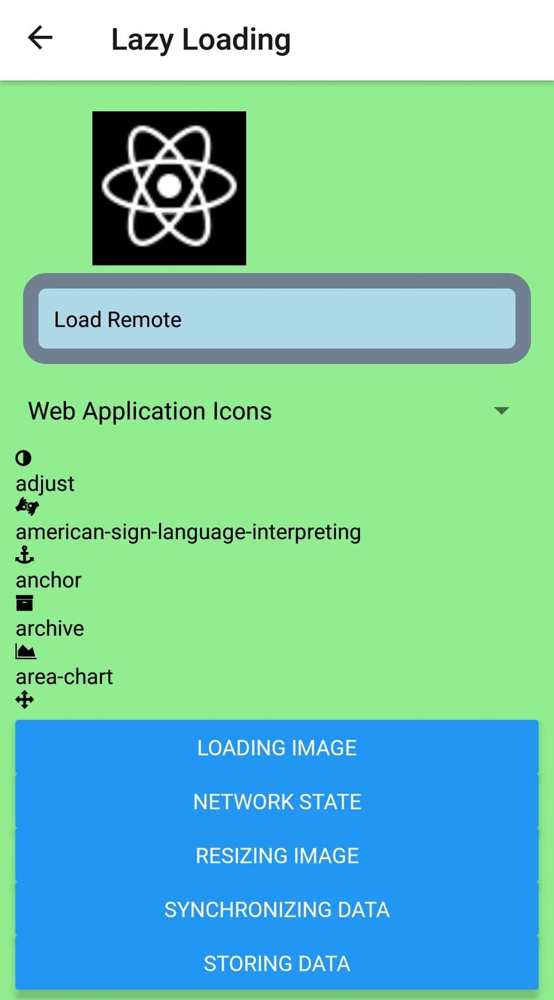

## Network state
Jeżeli mamy połączenie z internetem to pojawia się napis `connected`, jeżeli nie mamy połączenia to pojawia się napis `disconnected`

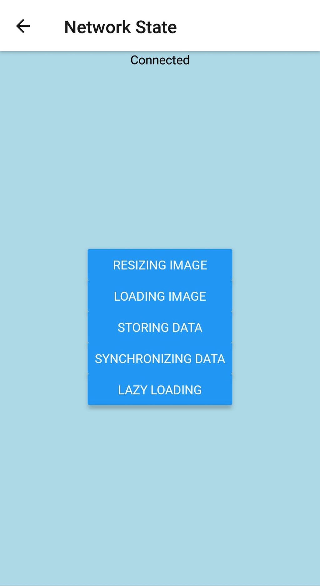

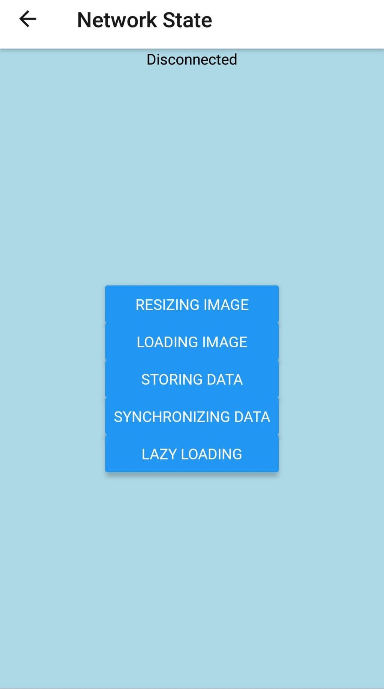

## Storing data
Na piątym ekranie została zaimplementowana obsługa zapisu danych aplikacji za pomocą `AsyncStorage`

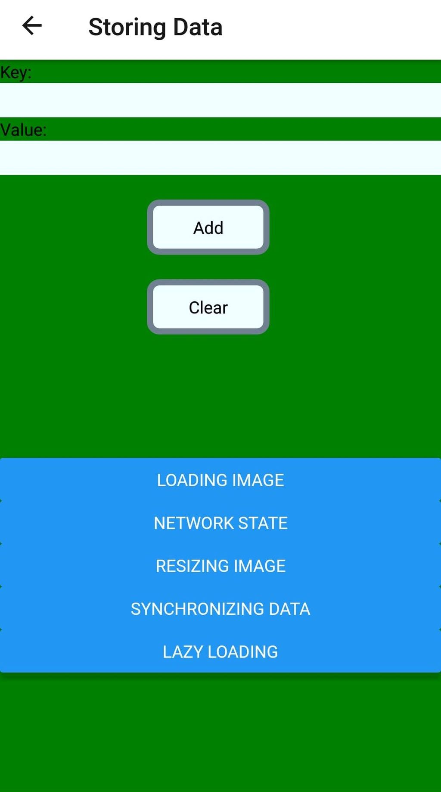


Działanie strony polega na tym że stany podczas bycia offline są zapamiętywane i są nadal takie same podczas przywrócenia połączenia

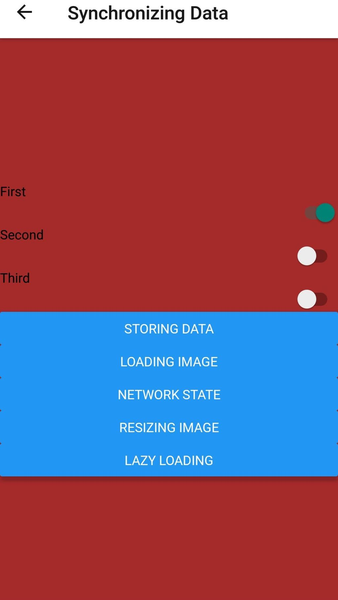

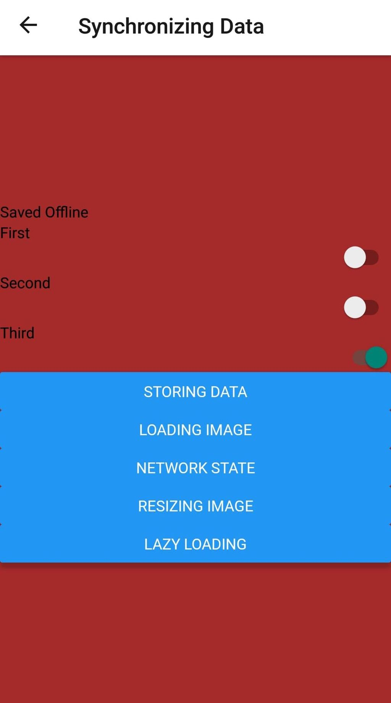

## Kod

`Home.js`
===
```
export default function Home({ navigation}) {
 return (
 <View style={styles.container}>

 <Button
 title={`Loading Image`}
 onPress={() =>
 navigation.navigate("LoadingImage", {
 id: "second",
 title: "Loading Image",
 })
 }
 />
 <Button
 title={`Resizing Image`}
 onPress={() =>
 navigation.navigate("ResizingImage", {
 id: "third",
 title: "Resizing Image",
 })
 }
 />
  <Button
 title={`Network State`}
 onPress={() =>
 navigation.navigate("NetworkState", {
 id: "third",
 title: "Network State",
 })
 }
 />
   <Button
 title={`Storing Data`}
 onPress={() =>
 navigation.navigate("StoringData", {
 id: "third",
 title: "Storing Data",
 })
 }
 />
    <Button
 title={`Synchronizing Data`}
 onPress={() =>
 navigation.navigate("SynchronizingData", {
 id: "third",
 title: "Synchronizing Data",
 })
 }
 />
     <Button
 title={`Lazy Loading`}
 onPress={() =>
 navigation.navigate("LazyLoading", {
 id: "third",
 title: "Lazy Loading",
 })
 }
 />
 </View>
 );
}
Home.navigationOptions = {
 title: "Home"
};
```

`LazyImage.js`
===
```
export default function LazyImage(props) {
  const [loaded, setLoaded] = useState(false);

  return (
    <View style={props.style}>
      <Placeholder loaded={loaded} {...props} />
      <Image
        {...props}
        onLoad={() => {
          setLoaded(true);
        }}
      />
    </View>
  );
}

LazyImage.propTypes = {
  style: PropTypes.shape({
    width: PropTypes.number.isRequired,
    height: PropTypes.number.isRequired
  })
};
```

`LazyLoading.js`
===
```
xport default function LazyLoading({ navigation}) {
  const [source, setSource] = useState(null);
  const [selected, setSelected] = useState("Web Application Icons");
  const [listSource, setListSource] = useState([]);
  const categories = Object.keys(iconNames);

  function updateListSource(selected) {
    setListSource(iconNames[selected]);
    setSelected(selected);
  }

  useEffect(() => {
    updateListSource(selected);
  }, []);
  

  return (
    <View style={styles.containerLazy}>
      <LazyImage
        style={{ width: 200, height: 100 }}
        resizeMode="contain"
        source={source}
      />
      <ButtonLazy
        label="Load Remote"
        onPress={() => {
          setSource({ uri: remote });
        }}
      />
	  <Picker selectedValue={selected} onValueChange={updateListSource}>
          {categories.map(category => (
            <Picker.Item key={category} label={category} value={category} />
          ))}
        </Picker>
		<FlatList
        style={styles.icons}
        data={listSource.map((value, key) => ({ key: key.toString(), value }))}
        renderItem={({ item }) => (
          <View style={styles.item}>
            <Icon name={item.value} style={styles.itemIcon} />
            <Text style={styles.itemText}>{item.value}</Text>
          </View>
        )}
      />
 <Button
 title={`Loading Image`}
 onPress={() =>
 navigation.navigate("LoadingImage", {
 id: "first",
 title: "Loading Image",
 })
 }
 />
  <Button
 title={`Network State`}
 onPress={() =>
 navigation.navigate("NetworkState", {
 id: "third",
 title: "Network State",
 })
 }
 />
      <Button
 title={`Resizing Image`}
 onPress={() =>
 navigation.navigate("ResizingImage", {
 id: "third",
 title: "Resizing Image",
 })
 }
 />
     <Button
 title={`Synchronizing Data`}
 onPress={() =>
 navigation.navigate("SynchronizingData", {
 id: "third",
 title: "Synchronizing Data",
 })
 }
 />
     <Button
 title={`Storing Data`}
 onPress={() =>
 navigation.navigate("StoringData", {
 id: "third",
 title: "Storing Data",
 })
 }
 />

   </View>
 );
}

LazyLoading.navigationOptions = ({
    navigation,
   }) => {
    const title = navigation.getParam("title");
    return {
    title,
    };
   };
```

`NetworkState.js`
===
```
export default function NetworkState({ navigation}) {
  const [connected, setConnected] = useState("");

  useEffect(() => {
    function onNetworkChange(connection) {
      setConnected(connectedMap[connection.type]);
    }

    const unsubscribe = NetInfo.addEventListener(onNetworkChange);

    return () => {
      unsubscribe();
    };
  }, []);

  return (
    <View style={styles.containerState}>
      <Text>{connected}</Text>
    <View style={styles.containerNav}>
      <Button
 title={`Resizing Image`}
 onPress={() =>
 navigation.navigate("ResizingImage", {
 id: "third",
 title: "Resizing Image",
 })
 }
 />
     <Button
 title={`Loading Image`}
 onPress={() =>
 navigation.navigate("LoadingImage", {
 id: "first",
 title: "Loading Image",
 })
 }
 />
   <Button
 title={`Storing Data`}
 onPress={() =>
 navigation.navigate("StoringData", {
 id: "third",
 title: "Storing Data",
 })
 }
 />
     <Button
 title={`Synchronizing Data`}
 onPress={() =>
 navigation.navigate("SynchronizingData", {
 id: "third",
 title: "Synchronizing Data",
 })
 }
 />
      <Button
 title={`Lazy Loading`}
 onPress={() =>
 navigation.navigate("LazyLoading", {
 id: "third",
 title: "Lazy Loading",
 })
 }
 />
 </View>
   </View>
 );
}
NetworkState.navigationOptions = ({
 navigation,
}) => {
 const title = navigation.getParam("title");
 return {
 title,
 };
};
```

`ResizingImage.js`
===
```
export default function ResizingImage({ navigation}) {
  const source = require("./images/relay.jpg");
  const [width, setWidth] = useState(100);
  const [height, setHeight] = useState(100);

  return (
    <View style={styles.containerSlider}>
      <Image source={source} style={{ width, height }} />
      <Text>Width: {width}</Text>
      <Text>Height: {height}</Text>
      <Slider
        style={styles.slider}
        minimumValue={50}
        maximumValue={150}
        value={width}
        onValueChange={value => {
          setWidth(value);
          setHeight(value);
        }}
      />
      <View style={styles.containerNav}>
     <Button
 title={`Loading Image`}
 onPress={() =>
 navigation.navigate("LoadingImage", {
 id: "first",
 title: "Loading Image",
 })
 }
 />
  <Button
 title={`Network State`}
 onPress={() =>
 navigation.navigate("NetworkState", {
 id: "third",
 title: "Network State",
 })
 }
 />
   <Button
 title={`Storing Data`}
 onPress={() =>
 navigation.navigate("StoringData", {
 id: "third",
 title: "Storing Data",
 })
 }
 />
     <Button
 title={`Synchronizing Data`}
 onPress={() =>
 navigation.navigate("SynchronizingData", {
 id: "third",
 title: "Synchronizing Data",
 })
 }
 />
      <Button
 title={`Lazy Loading`}
 onPress={() =>
 navigation.navigate("LazyLoading", {
 id: "third",
 title: "Lazy Loading",
 })
 }
 />
 </View>

   </View>
 );
}

ResizingImage.navigationOptions = ({
    navigation,
   }) => {
    const title = navigation.getParam("title");
    return {
    title,
    };
   };
```

`StoringData.js`
===
```
export default function StoringData({ navigation}) {
  const [key, setKey] = useState(null);
  const [value, setValue] = useState(null);
  const [source, setSource] = useState([]);

  function setItem() {
    return AsyncStorage.setItem(key, value)
      .then(() => {
        setKey(null);
        setValue(null);
      })
      .then(loadItems);
  }

  function clearItems() {
    return AsyncStorage.clear().then(loadItems);
  }

  async function loadItems() {
    const keys = await AsyncStorage.getAllKeys();
    const values = await AsyncStorage.multiGet(keys);
    setValues(values);
  }

  useEffect(() => {
    loadItems();
  }, []);

  return (
    <View style={styles.containerStoring}>
      <Text>Key:</Text>
      <TextInput
        style={styles.input}
        value={key}
        onChangeText={v => {
          this.data = this.data.set("key", v);
        }}
      />
      <Text>Value:</Text>
      <TextInput
        style={styles.input}
        value={value}
        onChangeText={v => {
          this.data = this.data.set("value", v);
        }}
      />
      <View style={styles.controls}>
        <ButtonStoring label="Add" onPress={setItem} />
        <ButtonStoring label="Clear" onPress={clearItems} />
      </View>
      <View style={styles.list}>
        <FlatList
          data={source.map(([key, value]) => ({
            key: key.toString(),
            value
          }))}
          renderItem={({ item: { value, key } }) => (
            <Text>
              {value} ({key})
            </Text>
          )}
        />
      </View>
      <View style={styles.containerNav}>
      <Button
 title={`Loading Image`}
 onPress={() =>
 navigation.navigate("LoadingImage", {
 id: "first",
 title: "Loading Image",
 })
 }
 />
  <Button
 title={`Network State`}
 onPress={() =>
 navigation.navigate("NetworkState", {
 id: "third",
 title: "Network State",
 })
 }
 />
      <Button
 title={`Resizing Image`}
 onPress={() =>
 navigation.navigate("ResizingImage", {
 id: "third",
 title: "Resizing Image",
 })
 }
 />
     <Button
 title={`Synchronizing Data`}
 onPress={() =>
 navigation.navigate("SynchronizingData", {
 id: "third",
 title: "Synchronizing Data",
 })
 }
 />
      <Button
 title={`Lazy Loading`}
 onPress={() =>
 navigation.navigate("LazyLoading", {
 id: "third",
 title: "Lazy Loading",
 })
 }
 />
</View>
   </View>
 );
}

StoringData.navigationOptions = ({
    navigation,
   }) => {
    const title = navigation.getParam("title");
    return {
    title,
    };
   };
```