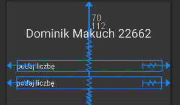
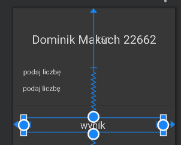
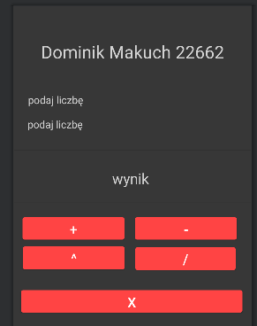
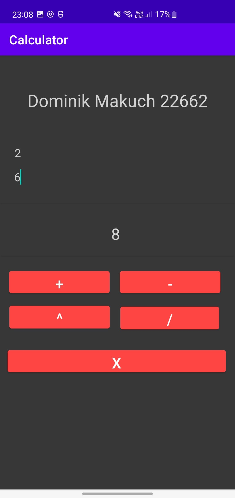
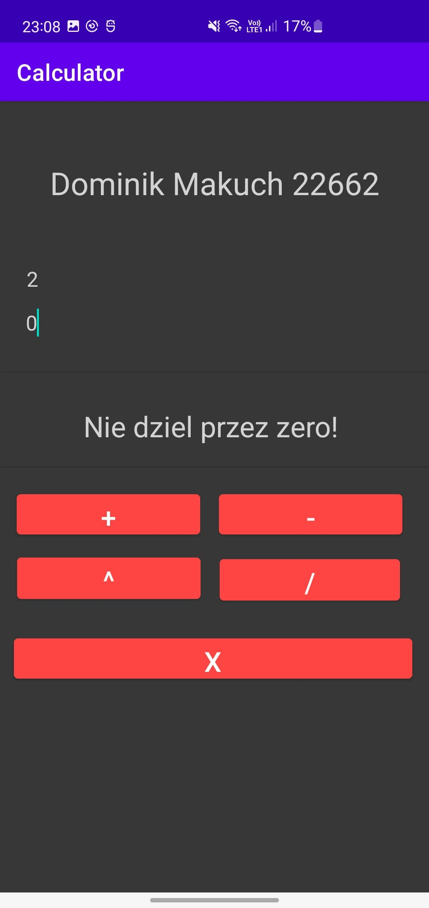
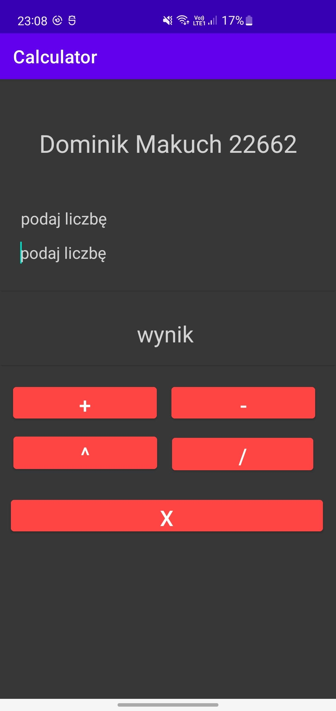
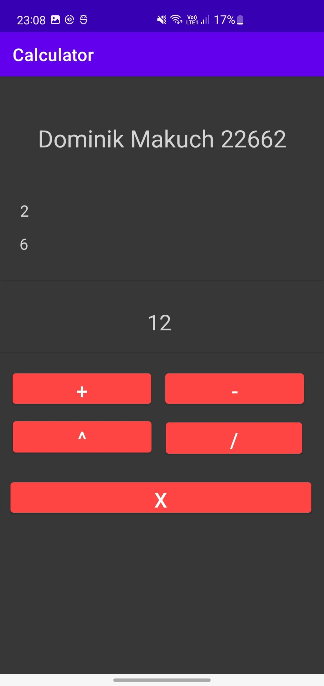
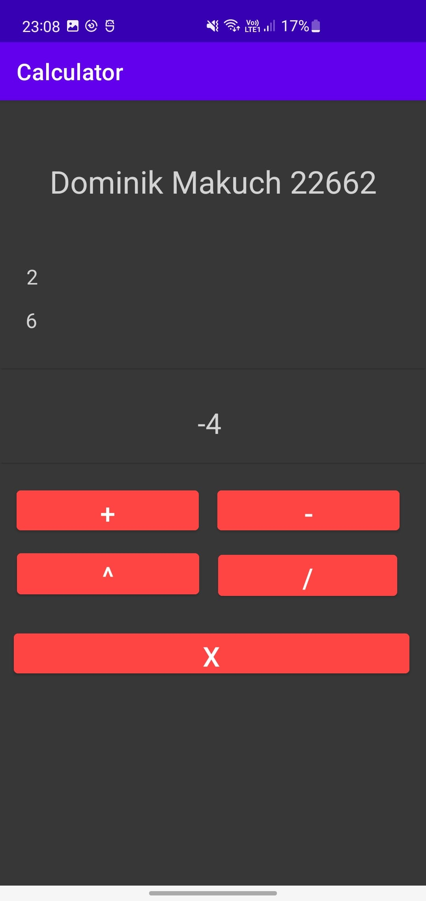
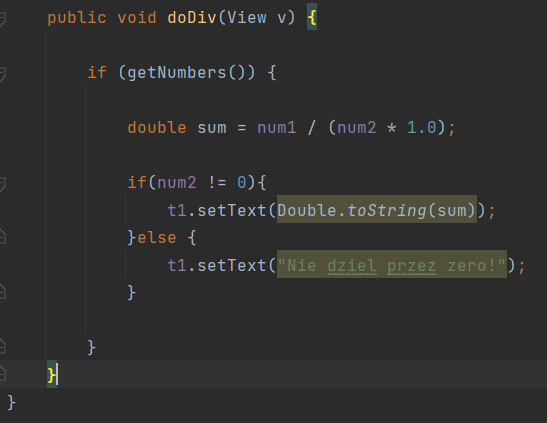

# Lab 1 - aplikacja startowa kalkulator
## Na potrzeby tego laboratorium stworzyłem prostą aplikację mobilną za pomocą Android Studio, pozwalającą na przeprowadzanie działań matematycznych (dodawanie, odejmowanie, mnożenie, potęgowanie, dzielenie) na dwóch liczbach.
* Aplikacja składa się z:
1. Dwóch pól editText służących do wprowadzania liczb:  

2. Pola textView odpowiadającego za wyświetlanie wyniku działania:  

3. Trzech przycisków odpowiadających za wykonanie odpowiadających im operacji:  

* Przykład działania aplikacji:
1. Dodawanie:  

2. Dzielenie przez zero:   

3. Ekran początkowy:   

4. Mnożenie:   

5. Odejmowanie:  

* Kod odpowiadający za dzielenie dwóch liczb: 
 
Przedstawiona powyżej metoda odpowiada za dzielenie dwóch liczb oraz wyświetlenie wyniku. 
Do zmiennej 'sum' przypisywany jest wynik dzielenie dwóch liczb pobieranych z pól editText. Następnie dokonywana jest walidacja czy dokonywane działanie nie jest dzieleniem przez zero i w przypadku jeśli jest wartość pola textView zmieniana jest na 'nie dziel przez zero' w przeciwnym wypadku wartość tego pola zmieniana jest na wynik działania.
